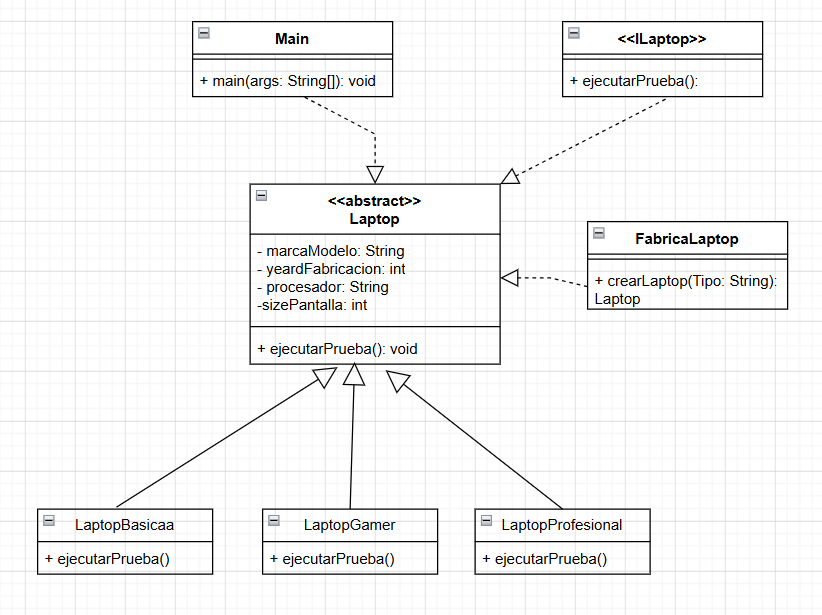

# Práctica 012: Diseño de Patrones de Software - Simple Factory

En esta practica se aplico los principios del patrón Simple Factory.

* **`ILaptop`**: Interfaz que define el contrato base.
* **`Laptop`**: Clase abstracta que implementa `ILaptop` y define los atributos principales (marcaModelo, yeardFabricacion, procesador, sizePantalla).
* **`LaptopBasicaa`, `LaptopGamer`, `LaptopProfesional`**: Clases concretas que sobrescriben el método `ejecutarPrueba()`.
* **`FabricaLaptop`**: Clase encargada de instanciar el modelo de laptop correcto basándose en los parámetros recibidos.
* **`Main`**: Clase cliente que ejecuta las pruebas con parámetros dinámicos.

----------------------------------------------------------------------------------
**Integrantes solo del diagrama:** 

- Bryan Smith Munoz Samame
- Lezama 

----------------------------------------------------------------------------------

## **Autor del repositorio:** Bryan Smith Munoz Samame